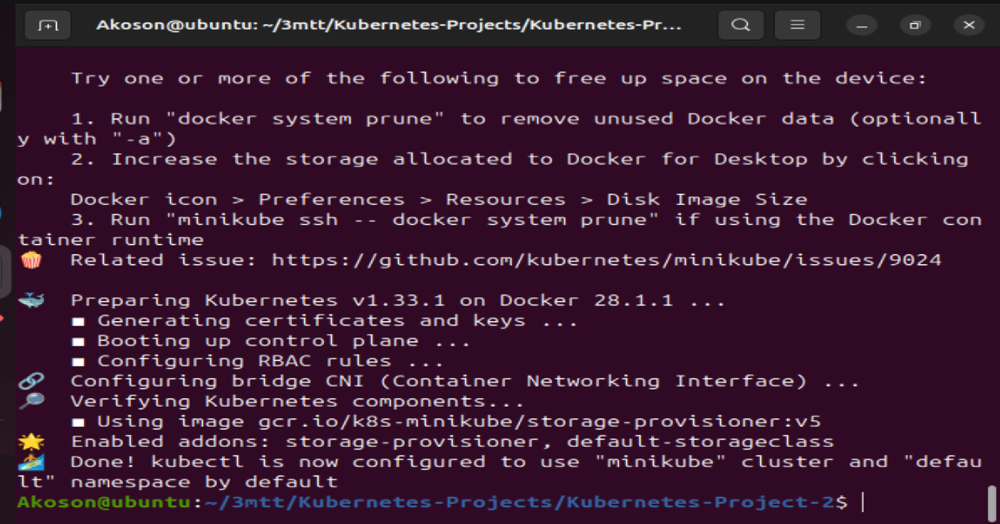
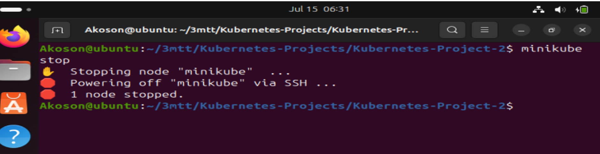
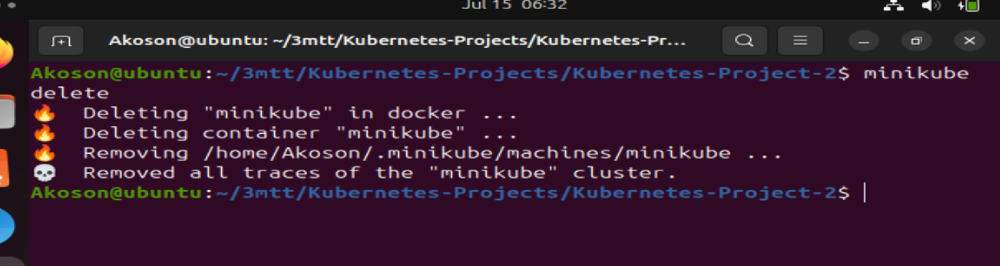
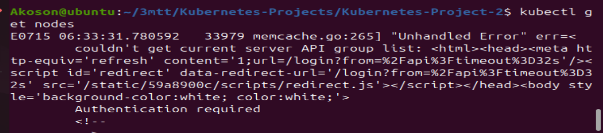
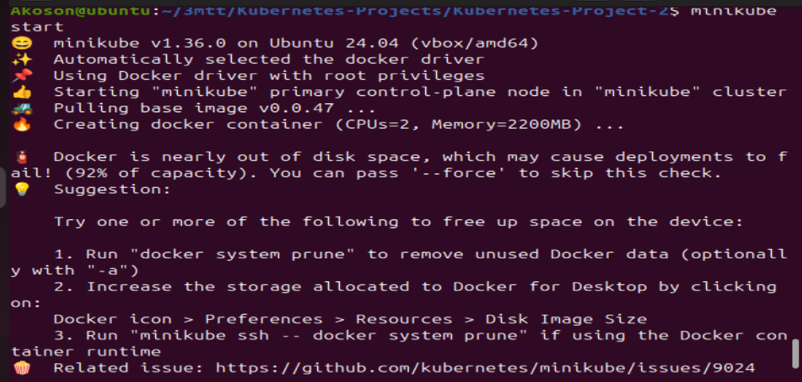
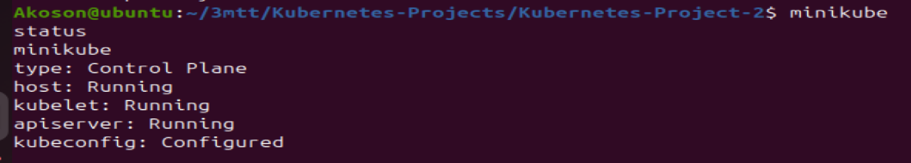
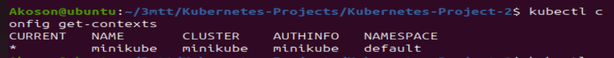
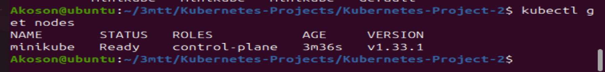
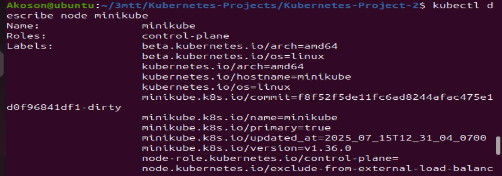

# Working with Kubernetes Nodes

## Kubernetes Nodes
## Now that we have our minikube cluster setup, let's dive into nodes in Kubernetes.

## What is a Node
### In Kubernetes, think of a node as a dedicated worker, like a dependable employee in an office, responsible for executing tasks and meeting containers to ensure seamless application performance.  

### A Kubernetes Node is a physical or virtual machine that runs the Kubernetes software and serves as a worker machine in the cluster. Nodes are responsible for running Pods, which are the basic deployable units in Kubernetes. Each node in a Kubernetes cluster typically represents a single host system.

## Managing Nodes in Kubernetes
### Minikube simplifies the management of Kubernetes for development and testing purposes. But in the context of minikube (a Kubernetes cluster), we need to start it up before we can be able to access our cluster.

### 1. Start Minikube Cluster:
```bash
minikube start
```


This command starts a local Kubernetes cluster (minikube) using a single-node Minikube setup.  
It provisions a virtual machine (VM) as the Kubernetes node.

## Steps to Verify Minikube Startup

**i** Run the command `minikube status` you will see output like: 
```
host: Running
kubelet: Running
apiserver: Running
```
### If it says "Stopped" or "Starting", then the cluster isn’t ready yet.

**ii** Check Node Status: `kubectl get nodes` Expected result:
```
NAME       STATUS   ROLES           AGE   VERSION
minikube   Ready    control-plane   XXm   v1.33.1
```
### If you get No resources found or a connection error, it’s still initializing.

**iii** Watch for Success Message
Minikube usually finishes with:

```
🌟  Enabling Kubernetes addons ...
🏄  Done! kubectl is now configured to use "minikube" cluster ...
```
### That final "Done!" confirms the cluster is ready for action.


### 2. Stop Minikube Cluster:
```bash
minikube stop
```


Stops the running Minikube (local Kubernetes cluster), preserving the cluster state.

### 3. Delete Minikube Cluster:
```bash
minikube delete
```


Deletes the Minikube Kubernetes cluster and its associated resources.

### 4. View Nodes:
```bash
kubectl get nodes
```


Lists all the nodes in the Kubernetes cluster along with their current status.

## Troubleshooting couldnt get current Server API group list error:

### This means that kubectl is trying to talk to a Kubernetes cluster called "minikube", but it can't find a valid API server configuration for it.

## This usually happens when:

- Minikube is not running, or

- The Kubernetes config file (~/.kube/config) is broken or not set, or

- The cluster has not been initialized, or

- You're on a new terminal and Minikube’s environment is not set.

**1** Start Minikube:
`minikube start`



### This command will create and configure the cluster and set the context in your kubeconfig file.

**2** Check Minikube Status:
`minikube status``
### You should see output like:



**3** Verify kubectl context:
`kubectl config get-contexts`



**4** After all that, verify everything is working
`kubectl get nodes`
### If Minikube is running correctly, you'll see something like:




### 5. Inspect a Node:
```bash
kubectl describe node <node-name>
```


Provides detailed information about a specific node,  
including its capacity, allocated resources, and status.

## Node Scaling and Maintenance
Minikube is often used for local development and testing;  
scaling nodes may not be as critical as in production environments.  
However, understanding the concepts is beneficial.

### Node Scaling
Minikube is typically a single-node cluster,  
meaning you have one node to run, test, and experiment with.

### Node Upgrades
Minikube allows you to easily upgrade your local cluster to a new Kubernetes version,  
ensuring that your development environment aligns with the target production version.

By effectively managing nodes in Minikube Kubernetes clusters,  
we can create, test, and deploy applications locally,  
simulating a Kubernetes cluster without the need for a full-scale production setup.  
This is particularly useful for debugging, experimenting,  
and developing applications in a controlled environment.
